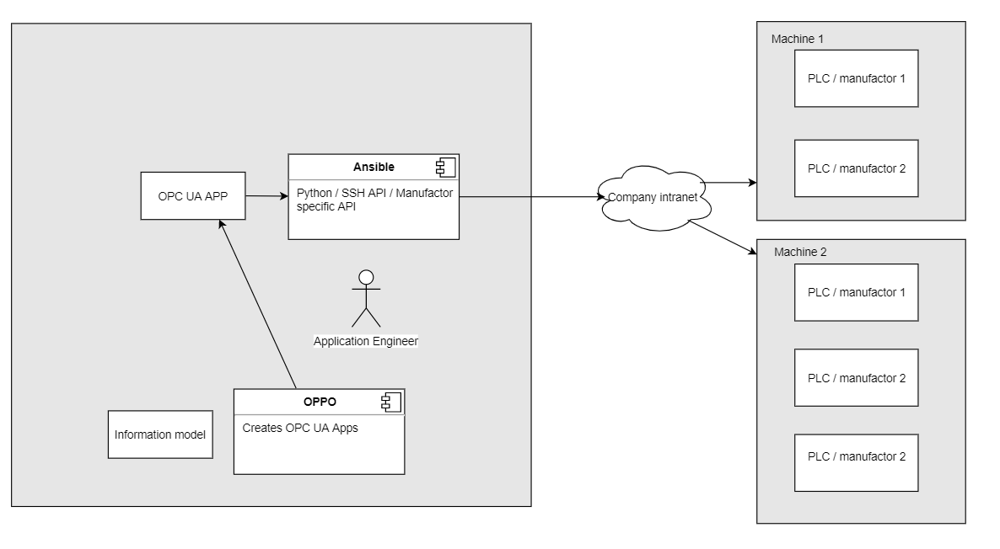

.. _infrastructureascode_reference:

================================
APPIO and infrastructure as code
================================

APPIO was as an infrastructure tool designed, in that sense that it creates and orchestrates OPC UA clients and servers. After the creation of the Debian package, the package should be delieverd and installed on the target system.
This can be done by infrastructure as code tools like Ansible. The idea is to create the opcuaapps on the local system and to make the delivery with Ansible. This should be easy on Linux systems, and it might be also possible to add PLC support of certain manufacturs to Ansible.
Using  infrastructure as code tools also introduces the opportunity to use APPIO in test driven way. In this example Molecule is used to create an Ansible role that creates an opcuaapp. 

The advantage of this is, to have automatic tests that ensure the correct creation of the opcuaapps.
In a production environment that demands a high changeability of its machines and their communciation, a quick and secure way to automaticly generate and delviever the communciation instances is invalueble.
In conjunction wtih an infrastructure as code tool APPIO is a good step in the right direction.

Here is the component diagramm:

Please note that this example is only a prove of concept.
In the future, more examples will be added. If you see possible improvements please let us know.

This example contains:

- an Ansible role that installs APPIO on the local system
- an Ansible role that creates an APPIO opcuaapp on the local system
- an Ansible role that delievers the APPIO opcuaapp to an Ubuntu server

You can find the example in the example folder of the `APPIO repository <https://github.com/appioframework/APPIO-Terminal.git>`_.
