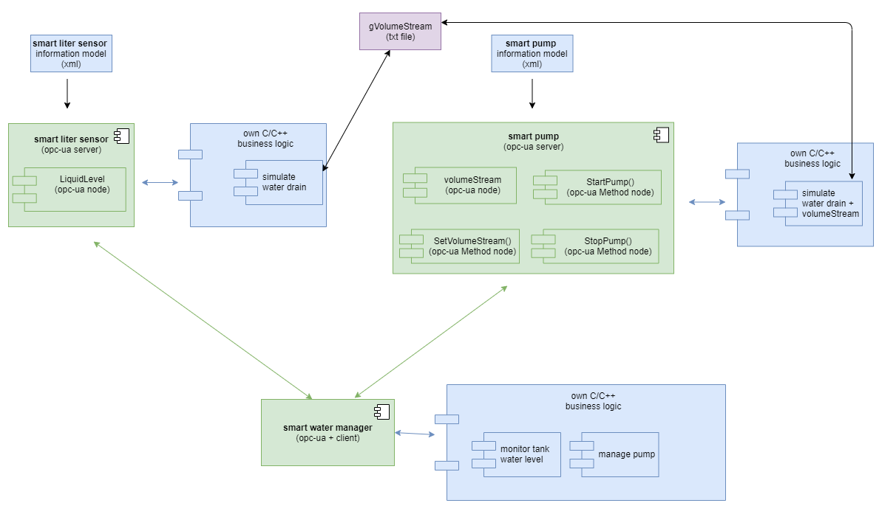
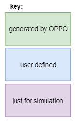

.. _smartpump_reference:

==============
Pump example
==============

In this tutorial we will see a more practical example. We will create an APPIO solution which contains three opcuaapps. Two servers and one client who simulate a simple pump control.
Before we begin, you need to have installed APPIO on a fully updated Linux. For checking the results of this tutorial an OPC UA front end client like UA Expert by Unified Automation is recommended.

The files needed for this tutorial can be found in the example folder of the `github repository <https://github.com/appioframework/APPIO-Terminal.git>`_.

***************************
Overview
***************************

This example contains two OPC UA Servers, which simulate a smart pump and a smart sensor. The smart sensor measures the actual water level of a container, who leaks water. The smart pump increases this level when activated.

The client called smart water manager, gets the actual water level from the smart sensor via an OPC UA Method, and activates/deacivates the smart pump (again over OPC UA methods) accordingly to user defined limit.
 

*****************************
Start: Creating the opcuaapps
*****************************

First we will create the smart liter sensor app:

.. code-block:: bash

   appio new opcuaapp --name SmartLiter --type Server --url 127.0.0.1 --port 3000 --nocert

This will create the OPC UA server for the pump:

.. code-block:: bash

   appio new opcuaapp --name SmartPump --type Server --url 127.0.0.1 --port 4000 --nocert

This will create the OPC UA client for the water manager:

.. code-block:: bash

   appio new opcuaapp --name SmartWaterManager --type Client --nocert

Now all needed opcuaapps were created.

*************************************
Importing the information model files 
*************************************

The information-models for the SmartPump and the SmartLiter are provided by us. They use the DiNodeset. Execute the following commands:

.. code-block:: bash

   appio import information-model -n SmartLiter -p path/to/DiNodeset.xml && \
   appio import information-model -n SmartPump -p path/to/DiNodeset.xml

Finally we need to import the real information models:

.. code-block:: bash

   appio import information-model -n SmartLiter -p path/to/slsNodeset.xml && \
   appio import information-model -n SmartPump -p path/to/spNodeset.xml

Now we need to generate them:

.. code-block:: bash

   appio generate information-model -n SmartLiter && \
   appio generate information-model -n SmartPump 

*******************************
Adding References to the client
*******************************

After the configuration of the OPC UA servers we need to add server references to the client:

.. code-block:: bash

   appio reference add --client SmartWaterManager --server SmartLiter   && \
   appio reference add --client SmartWaterManager --server SmartPump  

*******************************
Creating a solution
*******************************

For conviences we will create a solution and add the opcuaapps:

.. code-block:: bash

   appio new sln -n PumpSolution                               && \
   appio sln add -s PumpSolution --project SmartPump           && \
   appio sln add -s PumpSolution --project SmartLiter          && \
   appio sln add -s PumpSolution --project SmartWaterManager  

************************************
Implementing the business logic code
************************************

In the generated file you will find placeholders for making the connection between your business logic and the opcuaapp. This File is called mainCallbacks.c

Example:

.. code-block:: c

   // callback of Method
   UA_MethodCallback MethodCallback(UA_Server *server, const UA_NodeId *sessionId, void *sessionContext, const UA_NodeId *methodId, void *methodContext, const UA_NodeId *objectId, void *objectContext, size_t inputSize, const UA_Variant *input, size_t outputSize, UA_Variant *output)
   {
       // Your Method call of your business code goes here 
       return UA_STATUSCODE_GOOD;
   }

For the convience of this tutorial we prepared all files. You will find them in the examples folder we provided.

Here for the SmartPump:

.. code-block:: bash

   cp pathTo/APPIOframework/examples/smart_pump_example/source/smart_pump/mainCallbacks.c SmartPump/src/server/mainCallbacks.c  && 
   cp pathTo/APPIOframework/examples/smart_pump_example/source/smart_pump/pumpSimulation.c SmartPump/src/server/pumpSimulation.c 
   

Here for the smart liter sensor:

.. code-block:: bash

   cp pathTo/APPIOframework/examples/smart_pump_example/source/smart_liter_sensor/tankSimulation.c SmartLiter/src/server/tankSimulation.c &&
   cp pathTo/APPIOframework/examples/smart_pump_example/source/smart_liter_sensor/mainCallbacks.c SmartLiterSensor/src/server/mainCallbacks.c 

And now for the client:

.. code-block:: bash

   cp pathTo/APPIOframework/examples/smart_pump_example/source/smart_water_manager/main.c SmartWaterManager/src/client/main.c && 
   cp pathTol/APPIOframework/examples/smart_pump_example/source/smart_water_manager/manager.c SmartWaterManager/src/client/manager.c 
   
************************************
building and testing
************************************

Now it's time to build and test this solution:

.. code-block:: bash

   appio sln build -s PumpSolution  && \
   appio sln publish -s PumpSolution 

Now start all the opcuaapps and test it with the front end client. The pump should be turned on / off when the value provide by the sensor crosses the limit.